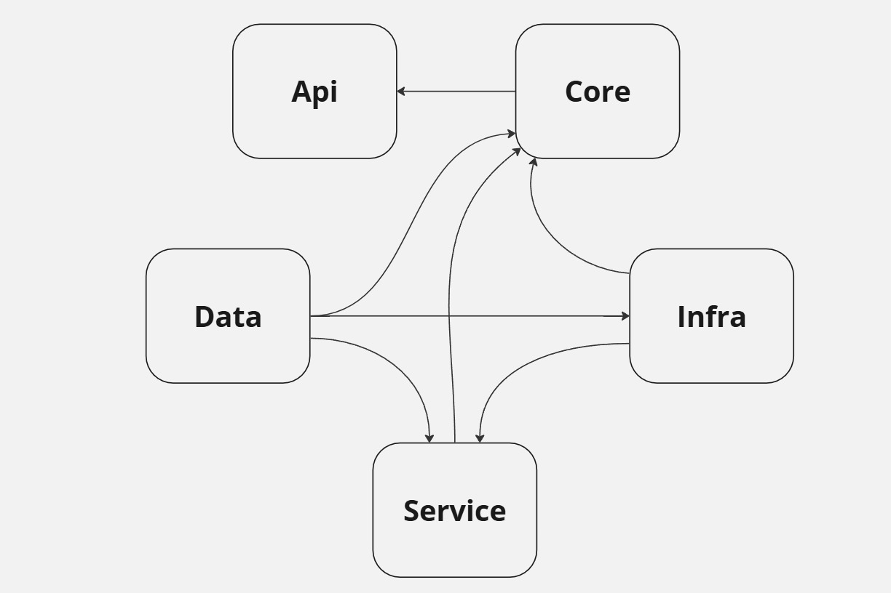

# Sample Clean Architecture  Authentication with RefreshToken & Authorization  

### Features:
    1.Mediator & CQRS Design Pattern

    2.Generic(Repository) Design Pattern

    3.Handle Rpository with Unit Of Work (UOW) Pattern

    4.Fluent Validations 

    5.Mapping result using AutoMapper

    6.Using Data Annotations & FluentValidation

    7.Rate Limiter

    8.Handle auto added createdAt & UpdatedAt fields on db

    9.Allow CORS

    10.Handle SoftDelete

    11.Handle Authentication with refreshToken

    12.Added JWT Token And SwaggerGen

    13.Authorizations(Roles)

    14.Handle send confirmation Email

    15.Filters

    17.Logs using serilog

